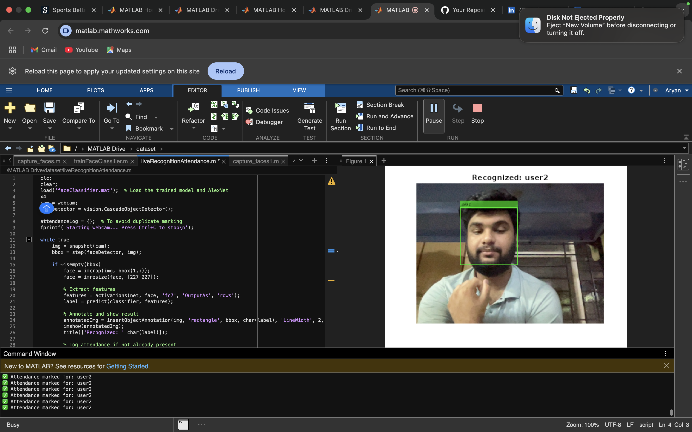
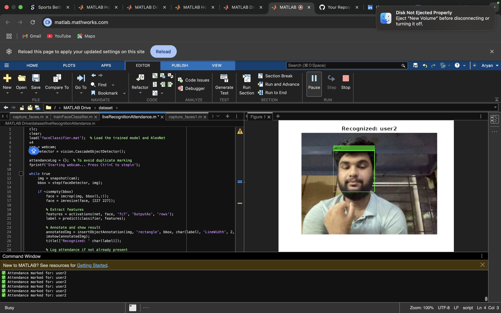

# 📸 Live Face Recognition Attendance Logger

A real-time face recognition attendance system built in **MATLAB** using **AlexNet + SVM**, designed to detect faces via webcam and log attendance with timestamps into a CSV file.

---

## 🚀 Demo

### 🖼️ Face Detection & Recognition  

### 📋 Attendance Logged in CSV  

---

## 🧠 How It Works

1. **Face Detection** using Haar Cascades
2. **Feature Extraction** via pretrained **AlexNet**
3. **Classification** using an SVM model
4. **Live Recognition** using webcam feed
5. **Attendance Logging** with timestamp in `attendance.csv`
6. Prevents **duplicate entries** during a single session

---

## 📁 Folder Structure

